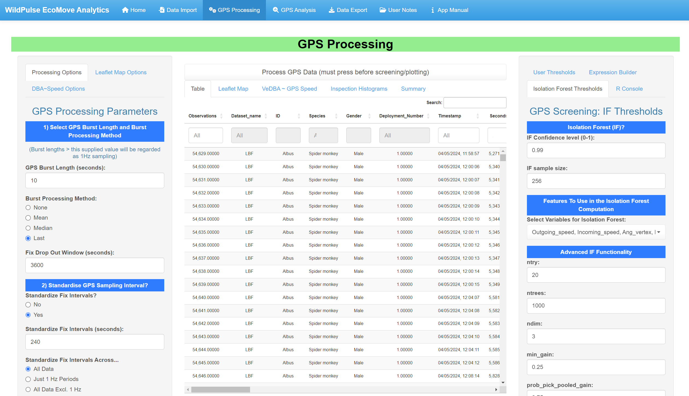
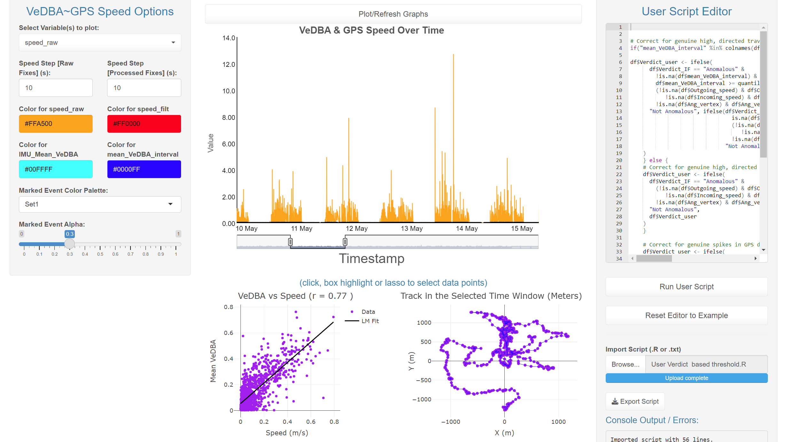
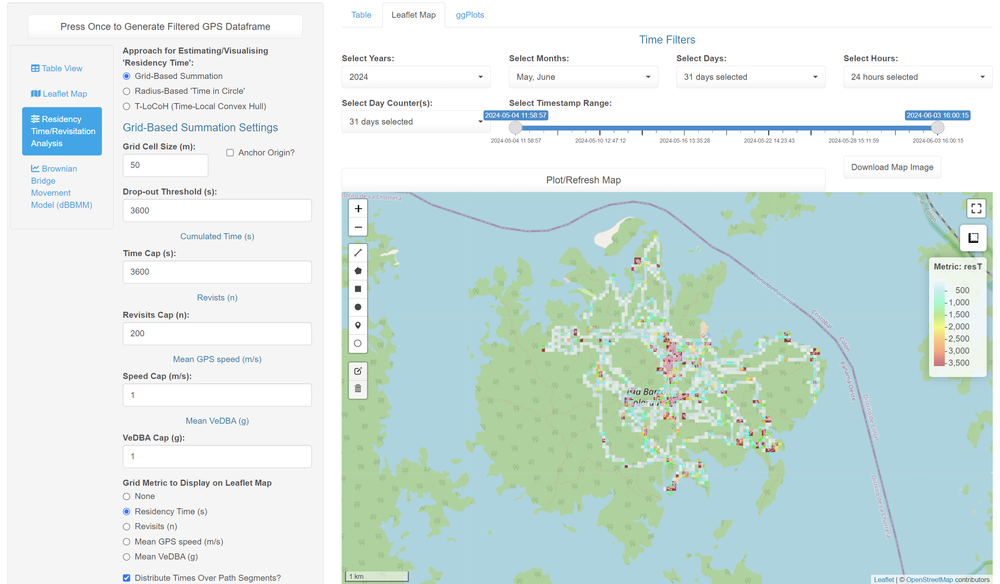

# WildPulse EcoMove Analytics

**WildPulse EcoMove Analytics** is an R/Shiny web application for importing, preprocessing, screening, analyzing, and exporting wildlife tracking data (GPS + optional VeDBA data derived from accelerometer data).

This **README** provides a comprehensive overview of each code section (UI tabs, server logic, key parameters), explaining how to navigate and utilize the application.

**Note, this app is still in active development. Any bug reports and suggestions welcome!**


---

## Table of Contents

- [Overview](#overview)
- [Dependencies](#dependencies)
- [Usage](#usage)
- [App Layout](#app-layout)
  - [1. Home Tab](#1-home-tab)
  - [2. Data Import Tab](#2-data-import-tab)
  - [3. GPS Processing Tab](#3-gps-processing-tab)
  - [4. GPS Analysis Tab](#4-gps-analysis-tab)
  - [5. Data Export Tab](#5-data-export-tab)
  - [6. User Notes / Manual Tab](#6-user-notes--manual-tab)
- [Additional Info of Metrics & Verdicts Computed in App](#additional-info-of-metrics--verdicts-computed-in-app)
- [Contact & Acknowledgments](#contact--acknowledgments)

---

## Overview

The WildPulse EcoMove Analytics Shiny app is designed to streamline data workflows for movement ecology. It provides:

- CSV/RDS/FST import and flexible variable mapping (Timestamp, Lat, Lon, VeDBA, etc.)
- Timestamp format building (date/time pickers) and timezone correction
- Timestamp exclusion filters
- GPS burst merging/collapsing and standardizing retained GPS fixes to uniform interval sampling (based on nearest-neighbour approach).
- Track smoothing (median, Savitzky-Golay)
- Interactive visualization of GPS and VeDBA data over time (Leaflet, Plotly, Dygraph)
- Anomaly detection (custom rules and/or Isolation Forest)
- Raster based analysis tools of processed GPS data (e.g., grid-based residency time)
- Data and notes export

---

## Dependencies

Automatically installs and loads (if needed):

 "DT", "xts", "rgl", "zoo", "shiny", "dplyr", "ggplot2", "spsComps", "janitor",
  "dygraphs", "lubridate", "data.table", "colourpicker", "RColorBrewer",
  "shinyvalidate", "shinycssloaders", "shinyWidgets", "shinythemes",
  "shinyjs", "htmltools", "leaflet", "tidyr", "Rcpp", "assertthat",
  "fst", "plotly", "isotree", "leaflet.extras", "sf", "leafgl",
  "jsonlite", "shinyAce", "signal", "RcppRoll", "leafem",
  "raster", "MASS", "terra", "stats", "ks", "KernSmooth", "shinyscreenshot"

Requires R 4.0+ and preferably RStudio. Includes C++ code for time-stepping logic.

---

## Usage

1. **Download** or clone the repository containing `app.R`.
2. **Open** RStudio (or a terminal R session) and set your working directory to the folder with the Shiny app.
3. **Run**

```r
library(shiny)
shiny::runApp("path/to/app/folder")
```
Or press **Run App** if using RStudio’s GUI.

4. Interact with the multi-tab interface in your browser.
5. For a general orientation, see the App Layout sections below.

---

## App Layout

### 1. Home Tab

- **Welcome & Overview**  
- Institutional logos and media  
- Quick start guide to importing data  

### 2. Data Import Tab

- **File Input:** Accepts `.csv`, `.txt`, `.rds`, `.fst`  
- **CSV Options:** Separator (, or ; or \t), quote char, header check.  
- **Variable Selection:** (Pick columns for `Timestamp`, `GPS_Longitude`, `GPS_Latitude`, `IMU_Mean_VeDBA`, etc.). 
- **Study metadata:** User-chosen study name, ID, species, gender and deployment number to include in exported data frame.   
- **Timestamp Format Builders:**  Use pickers for date/time parts (`%Y`, `%m`, `%d`, `%H`, `%M`, `%S`, `%OS`) plus custom separators. Preview and example shown.
- **Timezone / Subset:** Additional sub-tab to shift time or add date/time-based exclusions.
- **Sampling Rate Plots:** Additional sub-tab to View sampling rate of GPS fixes and (optionally) VeDBA bursts over time. 
- **Table view customization**

### 3. GPS Processing Tab

- **GPS Burst Length & Method:** Collapses closely spaced GPS burst fixes (Mean, Median, Last, or None per burst).
- **Uniform interval standardization** (A compiled C++ function picks approximate time steps every N seconds, i.e., which fix after last retained fix is closest to user specified time interval, and so on, iteratively).
- **VeDBA Integration:** Merge VeDBA data with GPS intervals; compute mean VeDBA per preceeding GPS fix 
- **Track smoothing:** (**Median** with user-chosen window size (odd) or **Savitzky-Golay** polynomial smoothing.
- **Leaflet map:** Toggle raw vs. processed points/lines, color/size, cluster or popups, and base map tile. Possibly uses leafgl (WebGL) for large data. Clicking GPS points can manually re-label them as “Anomalous” or “Not Anomalous.”
- **DBA~GPS speed plots** 
- **Inspection histograms of GPS metrics and quantile calculation** 
- **R Console:** A mini built-in console to run R scripts that modify the data (especially user-defined columns or verdicts). See `Example User Verdict Based Threshold.R` to load in the app for example.




#### Isolation Forest & Expression Builder
**Expression Builder:**  
The user builds a custom statement `ifelse(...)` that assigns `'Anomalous'` or `'Not Anomalous'`.

Insert operators (`>`, `<`, `&`, etc.), thresholds (like `Anglespeed`, `GPSaccuracy`), and eventually end with 'Anomalous', 'Not Anomalous')`.

**Isolation Forest:**  
Uses the `isotree` package, letting the user choose variables (e.g., `Outgoing_speed`, `Ang_vertex`, `mean_VeDBA_interval`), confidence level (e.g., `0.99`), and tree parameters.

Scores above the user-chosen quantile become `'Anomalous'`.
---

#### Leaflet Visualizations

In GPS Processing and GPS Analysis, the code uses `leafletProxy` to add or remove layers:
- Raw points, processed points, lines, popups, clusters etc. 
- Optionally a heatmap or kernel density overlay  
The user picks color, line widths, base map tile (`OpenStreetMap` or `Esri.WorldImagery`), etc.
Clicking on points can open popups, enable re-labelling of screened fixes as 'Anomalous' or 'Not Anomalous', and store a “selected” row for manual overrides.

### 4. GPS Analysis Tab

- **Refresh Subset:** Typically excludes “Anomalous” points or re-checks final track.
- **Recalculate** speed, angles, etc., with the newly filtered data.
- **Residency time estimation:** grid-based or line-based. Also summaries of revisit counts, average speed, or VeDBA in each cell.  
- **Point- and kernel-based heatmaps**   



### 5. Data Export Tab

- **Choose:** “Processed GPS Data” or “Analysis Subset.” 
- **Download formats:** `.csv`, `.txt`, `.rds`, `.fst`
- **Download:** Press button to save to disk.  

### 6. User Notes / Manual Tab

- **TextArea** for taking notes or writing manual instructions.
- **Save** or **Load** notes, exporting to .txt. 

---

### Additional Info of Metrics & Verdicts Computed in App

When the Shiny app processes GPS data (especially in the **GPS Processing** or **GPS Analysis** steps), it computes several key columns to help flag potential outliers and describe each fix’s movement geometry. Below is a brief description of the most common ones:

1. **`Ang_vertex`**  
   - *Definition*: The absolute turning angle in degrees at a focal fix, measured by comparing bearings to the previous and next points.  
   - *Calculation*:  
     1. Compute the bearing from \[previous fix → current fix\] and from \[current fix → next fix\].  
     2. The turning angle is the difference between these two bearings, normalized into a range \[0°, 180°\].  
   - *Interpretation*: A high value (close to 180°) implies the animal made a near “backtrack” or sharp turn at the current fix.

2. **`Outgoing_speed`**  
   - *Definition*: Speed (m/s) from the *previous* fix to the *current* fix.  
   - *Calculation*:  
     1. Haversine distance between the previous fix’s coordinates and the current fix’s coordinates.  
     2. Divide by the time difference in seconds between these two timestamps.  
   - *Interpretation*: Approximates how fast the animal was traveling *into* the current fix.

3. **`Incoming_speed`**  
   - *Definition*: Speed (m/s) from the *current* fix to the *next* fix.  
   - *Calculation*: Same distance/time approach as `Outgoing_speed`, but referencing the next fix in chronological order.  
   - *Interpretation*: Approximates how fast the animal *left* the current fix.

4. **`Dist_circular`**  
   - *Definition*: The chord (straight-line) distance between the previous and next fixes, bypassing the current fix.  
   - *Calculation*: Haversine distance directly from \[previous fix\] to \[next fix\].  
   - *Interpretation*: Helps identify “circular” or “triangular” anomalies. If `Dist_circular` is small but `Ang_vertex` is large, it may be suspicious or could indicate a near-u-turn.

5. **`Dist_from_median`**  
   - *Definition*: A measure of how far each fix is from a local “rolling median” position in space.  
   - *Calculation*:  
     1. Within a user-selected window of consecutive fixes (or a segment defined by certain grouping), compute the median latitude and longitude.  
     2. The fix’s `Dist_from_median` is the Haversine distance from its own coordinates to that median coordinate.  
   - *Interpretation*: Large values can flag outlier points that deviate from the local “cluster” of fixes in the window.

---

#### Verdict Columns: `Verdict_user`, `Verdict_IF`, and `combined_verdict`

During **anomaly/outlier** detection and **manual overrides**, the app maintains three key verdict columns:

1. **`Verdict_user`**  
   - *Definition*: Any user-specified label, typically `'Anomalous'` or `'Not Anomalous'`.  
   - *Populated By*:
     1. **Expression Builder**: custom logic (`ifelse(...)`) that sets `'Anomalous'` for points violating certain thresholds. 
     2. **In-app R Console**: User R script editor. 
     3. **Manual Overrides**: Clicking or selecting points in Leaflet/Plotly and DBA~GPS speed graphs and assigning a new verdict.  
   - *Interpretation*: The user’s direct classification of each fix.

2. **`Verdict_IF`**  
   - *Definition*: Verdict assigned by the **Isolation Forest** anomaly detection.  
   - *Populated By*:  
     - Pressing “Run Isolation Forest,” which calculates an anomaly score for each fix. Points above a user-chosen quantile threshold (e.g., 99th percentile) become `'Anomalous'`; others `'Not Anomalous'`.  
   - *Interpretation*: A purely algorithmic classification independent of user thresholds.

3. **`combined_verdict`**  
   - *Definition*: A merged label that reconciles both `Verdict_user` and `Verdict_IF`.  
   - *Calculation Logic*:  
     - If **both** `Verdict_user` and `Verdict_IF` exist, then:  
     - If **both** are `'Anomalous'`, then `combined_verdict` becomes `'Anomalous'`; otherwise if `Verdict_user` is `'Not Anomalous'` and `Verdict_IF` is `'Anomalous'`, then `combined_verdict` becomes `'Not Anomalous'`; otherwise if `Verdict_user` is `'Anomalous'` and `Verdict_IF` is `'Not Anomalous'`, then `combined_verdict` becomes `'Anomalous'`; otherwise if both are `'Not Anomalous'`, then `combined_verdict` becomes `'Not Anomalous'`.
   - If only `Verdict_user` is present, `combined_verdict` follows it; if only `Verdict_IF` is present, it uses that.  
   - *Interpretation*: The final classification used in most downstream steps. By default, “Anomalous” takes precedence when *`Verdict_user`* method flags the fix.

## Contact & Acknowledgments

For questions, bug reports, suggestions, or contributions, please contact:
- Richard Gunner
- Email: rgunner@ab.mpg.de
- GitHub: [Richard6195](https://github.com/Richard6195)

---